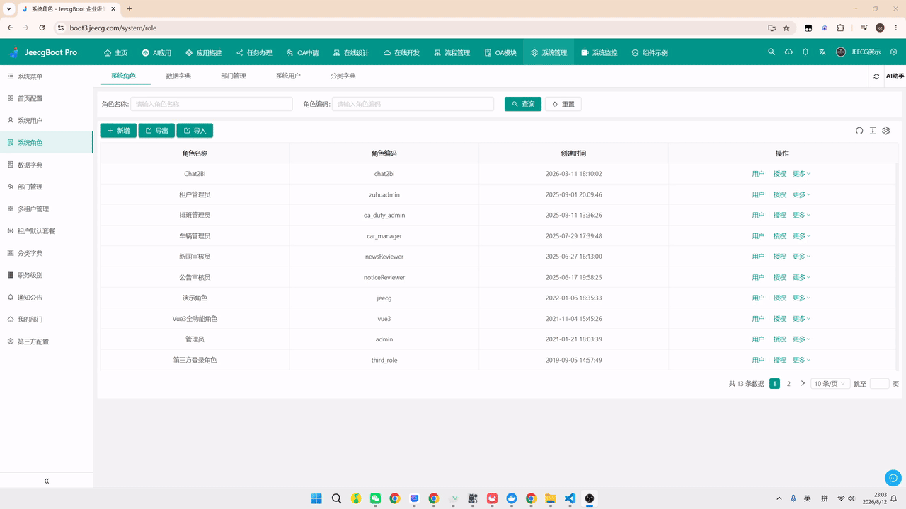

#  BugReplay

> 🎬 一键录制 Bug 现场，`.rrt` 离线回放，100% 还原案发现场 —— 让 QA 少写文字、开发秒懂根因。

[](LICENSE)
[](https://www.typescriptlang.org/)
[](https://vitejs.dev/)
[](https://developer.chrome.com/docs/extensions/mv3/)

---

## 📖 项目简介

在软件测试流程中，QA 发现 Bug 后通常通过文字 + 截图 + 录屏报告问题。这种方式存在**信息缺失、复现困难、沟通成本高**等痛点。

**BugReplay** 通过一键录制 Bug 发生时的完整现场 —— DOM 操作、网络请求、控制台日志 —— 生成离线 `.rrt` 脚本文件，开发人员打开该文件即可精准还原案发现场。

| 角色 | 价值 |
|------|------|
| QA 测试人员 | 一键录制，自动采集全部上下文，无需手动截图/描述 |
| 开发人员 | 离线回放，完整还原 DOM + 网络 + 控制台，精准定位根因 |
| 团队管理者 | 缩短 Bug 生命周期，提升交付质量 |

---

## 🎬 演示

> 一键录制 Bug 现场 → 标注问题 → 离线回放 → 一键提交禅道




---

## ✨ 核心功能

### 🎬 录制模块
- **DOM 录制**：基于 [rrweb](https://github.com/rrweb-io/rrweb)，录制完整 DOM 快照与增量变化
- **网络拦截**：代理 XHR / Fetch，记录请求与响应详情，自动过滤敏感 Header
- **控制台劫持**：拦截 `console.log/warn/error`，记录参数与调用栈
- **环境快照**：采集 URL、UserAgent、视口、Cookies、LocalStorage 等

### 🖊 标注模块
- **悬浮工具栏**：可拖拽，支持矩形框选 / 箭头指向 / 文本批注 / 自由画笔
- **颜色选择器**：预设 6 种颜色
- **步骤编号**：自动递增 Step 1, Step 2, ...
- **撤销 / 清除**：支持单步撤销和全部清除

### 📦 导出 (.rrt 格式)
- 一键下载 `.rrt` 文件（JSON 格式）
- 包含完整 rrweb 事件流、网络日志、控制台日志、标注数据、环境快照

### ▶️ 回放模块
- **rrweb-player** 渲染 DOM 回放
- **时间轴**：播放/暂停、拖拽跳转、0.5x~4x 速度控制、键盘快捷键
- **侧边栏**：控制台面板 + 网络请求面板，支持搜索过滤、点击展开详情
- **标注图层**：按时间轴精准叠加，可切换显示/隐藏

### 📦 导出 & 提交
- 一键导出 `.rrt`（JSON）离线脚本，支持复制到剪贴板
- 直接提交到 **禅道**，可选产品与项目
- **AI 生成 Bug 描述**：自动分析录制内容，生成复现步骤 / 预期结果 / 实际结果

---

## 🧩 平台支持

| 平台 | 能力 | 说明 |
|------|------|------|
| **禅道** | 创建 Bug + 上传附件 | REST API v1/v2，支持选择产品与项目 |
| **AI 助手** | 自动生成 Bug 描述 | 兼容 OpenAI 风格 Chat Completions API |

---

## 🛠 技术栈

| 层 | 技术 | 说明 |
|----|------|------|
| DOM 录制/回放 | **rrweb** | 业界成熟的 DOM 快照与事件流录制方案 |
| 扩展标准 | **Manifest V3** | Chrome/Edge 最新扩展规范 |
| 跨浏览器 | **webextension-polyfill** | 统一 Chrome/Firefox/Edge API |
| 构建工具 | **Vite + TypeScript** | 快速构建，多入口支持 |
| 插件框架 | **@crxjs/vite-plugin** | Vite 的 Chrome 扩展构建插件 |
| 标注工具 | **原生 Canvas API** | 轻量，满足矩形/箭头/文本/画笔需求 |
| 回放渲染 | **rrweb-player** | rrweb 官方回放 UI 组件 |
| 数据存储 | **IndexedDB** | 浏览器本地持久化录制数据 |

---

## 📁 项目结构

```
bug-replay/
├── docs/
│   └── 需求文档.md              # 详细需求文档
├── public/
│   └── icons/                   # 扩展图标
├── src/
│   ├── manifest.json            # Manifest V3 配置
│   ├── background/              # Service Worker
│   │   ├── service-worker.ts    # 消息路由 & 存储管理
│   │   ├── storage-manager.ts   # IndexedDB 封装
│   │   └── rrt-builder.ts       # .rrt 文件构建 & 导出
│   ├── content/                 # Content Script
│   │   ├── content-script.ts    # 主入口，协调 Recorder & Annotator
│   │   ├── annotator/           # 标注模块
│   │   │   ├── index.ts         # Annotator 控制器
│   │   │   ├── canvas-layer.ts  # Canvas 覆盖层
│   │   │   ├── toolbar.ts       # 悬浮工具栏
│   │   │   ├── annotation-manager.ts
│   │   │   └── tools/           # 绘图工具
│   │   │       ├── base-tool.ts
│   │   │       ├── rect-tool.ts
│   │   │       ├── arrow-tool.ts
│   │   │       ├── text-tool.ts
│   │   │       └── freehand-tool.ts
│   │   ├── recorder/            # 录制模块
│   │   │   ├── index.ts         # Recorder 控制器
│   │   │   ├── rrweb-recorder.ts
│   │   │   ├── network-interceptor.ts
│   │   │   ├── console-interceptor.ts
│   │   │   └── environment-snapshot.ts
│   │   └── utils/
│   │       ├── dom-utils.ts
│   │       └── serialization.ts
│   ├── popup/                   # 扩展弹出窗口
│   │   ├── popup.html
│   │   ├── popup.css
│   │   └── popup.ts
│   ├── replayer/                # 回放页面
│   │   ├── index.html
│   │   ├── replayer.ts          # 回放主控制器
│   │   ├── timeline.ts          # 时间轴组件
│   │   ├── sidebar.ts           # 侧边栏组件
│   │   └── annotation-overlay.ts # 标注叠加层
│   ├── platforms/               # 第三方平台集成（预留）
│   │   ├── base-platform.ts
│   │   ├── jira.ts
│   │   └── zentao.ts
│   └── shared/                  # 共享模块
│       ├── constants.ts
│       ├── messages.ts
│       ├── utils.ts
│       └── types/               # 类型定义
│           ├── index.ts
│           ├── annotation.ts
│           ├── console.ts
│           ├── environment.ts
│           ├── network.ts
│           ├── recording.ts
│           └── rrt-package.ts
├── package.json
├── pnpm-lock.yaml
├── tsconfig.json
└── vite.config.ts
```

---

## 🚀 快速开始

### 方式一：源码构建后加载（推荐）

```bash
pnpm install
pnpm build
```

1. 打开 Chrome，访问 `chrome://extensions/`
2. 开启 **开发者模式**
3. 点击 **加载已解压的扩展程序**
4. 选择项目 `dist/` 目录

### 方式二：本地开发

```bash
pnpm dev        # 开发构建（热更新）
```

> 环境要求：Node.js >= 18，pnpm >= 8

---

## 📝 .rrt 文件格式

`.rrt`（BugReplay Recording Tape）是本项目的离线录制脚本格式，本质为 JSON 文件：

```json
{
    "version": "1.0.0",
    "exportedAt": 1719705600000,
    "metadata": {
        "title": "Bug: 登录按钮点击无响应",
        "duration": 45000,
        "description": "Chrome 浏览器下，点击登录按钮后页面无任何反应",
        "tags": ["登录", "P1"],
        "extensionVersion": "1.0.0"
    },
    "environment": { /* 环境快照 */ },
    "rrwebEvents": [],
    "networkLogs": [],
    "consoleLogs": [],
    "annotations": []
}
```

---

## 🖥 浏览器兼容性

| 浏览器 | 最低版本 |
|--------|----------|
| Chrome | >= 88 (Manifest V3) |
| Edge | >= 88 |
| Firefox | >= 109 (Manifest V3) |

---

##  Roadmap

- [ ] 操作文档站（VitePress）
- [ ] 版本化发布 + Chrome 商店上架
- [ ] UI/UX 打磨、单元测试、CI
- [ ] 更多平台集成、AI 深度分析

> 详见 [TODO.md](./TODO.md)

---

## 💬 反馈 & 交流

- 有问题或建议 → 到 **GitHub Issues** 提交反馈
- 觉得不错 → 点个 ⭐ **Star** 支持一下！
- 关注公众号 **「Visio」**，获取使用技巧与更新动态

<p align="center">
    
</p>

---

## 📄 License

[CC BY-NC-SA 4.0](LICENSE) © BugReplay Team
