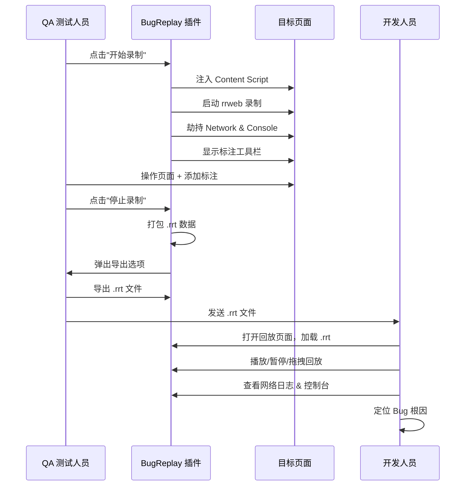
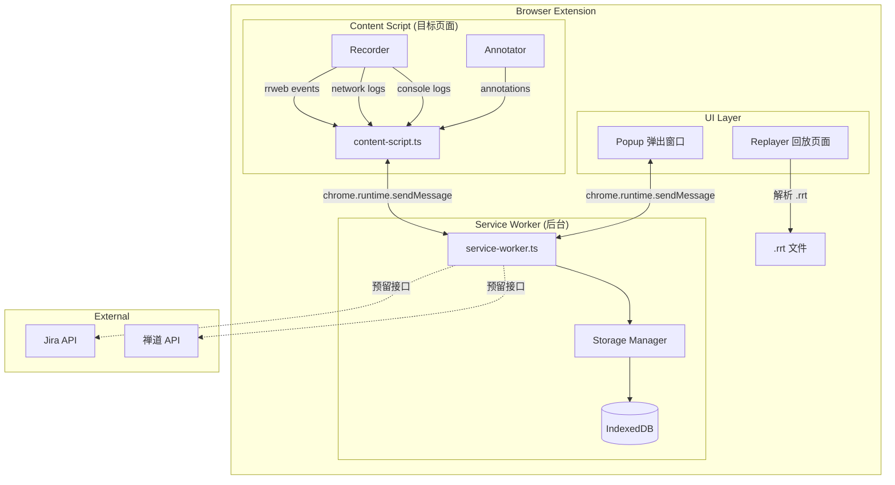
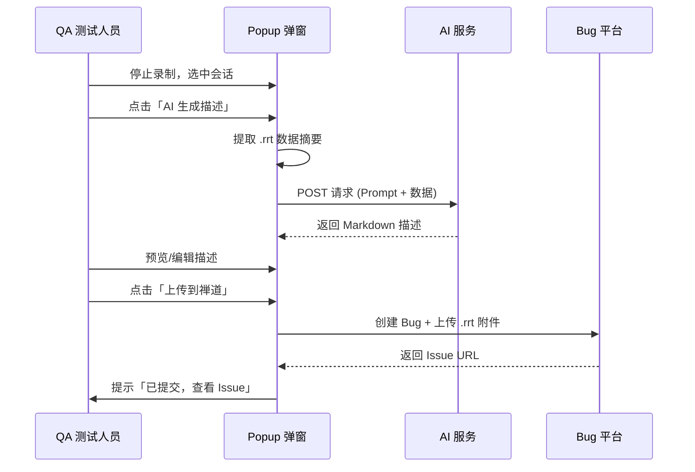

# BugReplay — 浏览器 Bug 复现录制回放插件

## 一、项目概述

### 1.1 项目背景

在软件测试流程中，QA 测试人员发现 Bug 后，通常通过文字描述 + 截图 + 录屏的方式向开发人员报告问题。这种沟通方式存在以下痛点：

- **信息缺失**：截图/录屏无法完整还原 DOM 状态、网络请求、控制台报错等关键上下文
- **复现困难**：开发人员需要手动再现 Bug 触发路径，耗时且不一定能成功
- **沟通成本高**：QA 与开发之间往复确认细节，效率低下

### 1.2 产品定位

BugReplay 是一款开源浏览器扩展，通过**一键录制** Bug 发生时的完整现场（DOM 操作、网络请求、控制台日志），生成离线 `.rrt`（BugReplay Recording Tape）脚本文件。开发人员打开该文件即可 **100% 还原案发现场**，大幅降低 Bug 复现沟通成本。

### 1.3 核心价值

| 角色 | 价值 |
|------|------|
| QA 测试人员 | 一键录制，自动采集全部上下文，无需手动截图/描述 |
| 开发人员 | 离线回放，完整还原 DOM + 网络 + 控制台，精准定位根因 |
| 团队管理者 | 缩短 Bug 生命周期，提升交付质量 |

---

## 二、技术栈

| 层 | 技术选型 | 说明 |
|----|---------|------|
| DOM 录制/回放引擎 | **rrweb** | 业界成熟的 DOM 快照与事件流录制方案 |
| 扩展标准 | **Manifest V3** | Chrome/Edge 最新扩展规范 |
| 跨浏览器兼容 | **webextension-polyfill** | 统一 Chrome/Firefox/Edge API |
| 构建工具 | **Vite + TypeScript** | 快速构建，多入口支持 |
| 标注工具 | **原生 Canvas API** | 轻量，满足矩形/箭头/文本/画笔需求 |
| 回放渲染 | **rrweb-player** | rrweb 官方回放 UI 组件 |
| 数据存储 | **IndexedDB** | 浏览器本地持久化录制数据 |
| 图标资源 | SVG/PNG 内联 | 减少网络依赖 |

---

## 三、功能模块

### 3.1 核心录制模块 (Recorder)

#### 3.1.1 rrweb DOM 录制

- 集成 rrweb `record()` API，录制页面完整 DOM 快照与增量变化
- 支持全量快照（`record()` 默认为 `record({ emit: callback })`）
- 事件类型覆盖：DOM 变更、鼠标交互、滚动、输入、视口变化
- 隐私保护：默认屏蔽 `input[type="password"]` 等敏感字段

#### 3.1.2 网络请求拦截

- **XHR 拦截**：代理 `XMLHttpRequest.prototype.open` / `send`，记录请求与响应
- **Fetch 拦截**：代理 `window.fetch`，记录请求与响应
- 采集字段：
  - 请求：URL、Method、Headers、Body
  - 响应：Status、StatusText、Headers、Body
  - 性能：StartTime、Duration
  - 错误：网络超时、CORS 错误、状态码异常
- 安全处理：过滤 `Authorization`、`Cookie` 等敏感 Header
- 大响应体处理：超过 100KB 自动截断并标记

#### 3.1.3 控制台日志劫持

- 劫持 `console.log` / `console.info` / `console.warn` / `console.error` / `console.debug`
- 记录参数、时间戳、调用栈（仅 error/warn）
- 参数安全序列化（JSON.stringify + 循环引用检测 + 特殊类型处理）
- 与 rrweb 事件时间轴对齐（通过 timestamp 关联）

#### 3.1.4 环境快照采集

- 页面信息：URL、Title
- 浏览器信息：UserAgent、Language、Platform
- 显示信息：屏幕分辨率、视口大小、DevicePixelRatio
- 存储状态：Cookies（非 HttpOnly）、LocalStorage、SessionStorage
- 采集时机：录制开始时一次性快照

---

### 3.2 标注与交互模块 (Annotator)

#### 3.2.1 悬浮工具栏

- 位置：页面右侧悬浮，可拖拽
- 按钮：矩形框选、箭头指向、文本批注、自由画笔、撤销、清除全部
- 颜色选择器：预设 6 种颜色（红/橙/黄/绿/蓝/紫）
- 步骤编号：自动递增（Step 1, Step 2, ...）
- 录制中可见，录制结束自动隐藏

#### 3.2.2 绘图工具

| 工具 | 交互方式 | 数据结构 |
|------|---------|---------|
| 矩形框选 | 鼠标拖拽绘制 | `{x, y, width, height, strokeColor, strokeWidth}` |
| 箭头指向 | 鼠标拖拽（起点→终点） | `{startX, startY, endX, endY, color, lineWidth}` |
| 文本批注 | 点击放置 + 输入文本 | `{x, y, text, fontSize, color}` |
| 自由画笔 | 鼠标按住拖拽 | `{points: [{x,y}], color, lineWidth}` |

#### 3.2.3 标注数据管理

- 独立于 rrweb 事件流存储
- 通过 `timestamp` 字段与 rrweb 时间轴对齐
- 支持撤销（删除最近一条标注）
- 回放时精准叠加显示

---

### 3.3 数据打包与导出 (.rrt 格式)

#### 3.3.1 .rrt 文件结构

```json
{
    "version": "1.0.0",
    "exportedAt": 1719705600000,
    "metadata": {
        "title": "Bug: 登录按钮点击无响应",
        "duration": 45000,
        "description": "Chrome 浏览器下，点击登录按钮后页面无任何反应",
        "tags": ["登录", "P1"],
        "extensionVersion": "1.0.0",
        "createdBy": "qa-zhangsan"
    },
    "environment": { /* EnvironmentSnapshot */ },
    "rrwebEvents": [],
    "networkLogs": [],
    "consoleLogs": [],
    "annotations": []
}
```

#### 3.3.2 导出方式

- **本地导出**：弹出窗口点击导出，触发浏览器下载 .rrt 文件
- **一键提交**（预留）：对接 Jira / 禅道 API，自动上传附件并创建 Bug
- **剪贴板**：复制 JSON 文本到剪贴板（快速分享）

---

### 3.4 回放模块 (Replayer)

#### 3.4.1 回放渲染

- 解析 .rrt 文件，提取各数据段
- 使用 rrweb-player 渲染 DOM 回放
- 全屏回放模式，模拟原始页面环境

#### 3.4.2 时间轴控制面板

- 播放/暂停按钮
- 进度条（可拖拽跳转）
- 速度控制：0.5x / 1x / 2x / 4x
- 时间显示：`00:23 / 01:45`
- 逐帧前进/后退（快捷键 ← →）

#### 3.4.3 侧边栏

- **网络请求面板**：
  - 列表展示所有请求（URL、Method、Status、耗时）
  - 点击展开查看完整 Request/Response
  - 搜索过滤
  - 根据回放时间高亮对应时刻的请求

- **控制台日志面板**：
  - 按时间排列，颜色区分级别（log=灰 / warn=黄 / error=红）
  - 点击展开查看完整参数
  - 搜索过滤
  - 根据回放时间高亮对应时刻的日志

#### 3.4.4 标注图层

- 开关按钮控制标注图层显示/隐藏
- 标注根据 timestamp 在对应时间点渐显
- 自动步骤编号（Step 1, Step 2, ...）

---

## 四、非功能需求

### 4.1 性能

- 录制时页面性能损耗 < 5%（rrweb 基线）
- 录制数据增量存储，避免内存溢出
- 网络响应体 > 100KB 自动截断
- 单个录制会话上限：30 分钟

### 4.2 安全

- 敏感请求头自动过滤（Authorization、Cookie、Set-Cookie）
- 密码输入框内容不录制
- 本地存储，数据不自动上传

### 4.3 兼容性

- Chrome >= 88（Manifest V3 最低版本）
- Edge >= 88
- Firefox >= 109（Manifest V3 支持版本）

### 4.4 可用性

- 插件安装后即用，无需登录/注册
- 悬浮工具栏直观易用
- .rrt 文件跨平台通用

---

## 五、用户交互流程



---

## 六、里程碑规划

| 阶段 | 内容 | 预计产出 |
|------|------|---------|
| M1: 项目脚手架 | Vite + TS + Manifest V3 工程搭建 | 可加载的空白扩展 |
| M2: 核心录制 | rrweb 集成 + 网络拦截 + 控制台劫持 + 环境快照 | 可录制并内存存储 |
| M3: 标注工具 | Canvas 覆盖层 + 四种绘图工具 + 工具栏 | 可在录制中标注 |
| M4: 数据打包 | .rrt 序列化 + 本地导出 | 可导出 .rrt 文件 |
| M5: 回放模块 | rrweb-player + 时间轴 + 侧边栏 + 标注图层 | 完整回放体验 |
| M6: Popup & SW | 消息通信 + IndexedDB 存储 + UI 美化 | 完整产品闭环 |
| M7: 集成 & 测试 | 第三方平台接口预留 + 跨浏览器兼容 | 可发布版本 |

---

## 七、扩展架构图



---

## 八、下一阶段功能规划（M8+）

### 8.1 设置页面 (Settings Page)

#### 8.1.1 概述

新增独立的扩展设置页面（`src/options/index.html`），提供 Bug 平台、AI 服务、个人信息等配置项的统一管理入口。Popup 底部 "上传" 按钮将依赖此配置执行一键提交流程。

#### 8.1.2 平台配置

| 平台 | 配置项 | 说明 |
|------|--------|------|
| **禅道** | 服务地址 `baseUrl`、API Token、产品 ID、默认模块/严重程度/优先级 | REST API v1 认证 |
| **Jira** | 实例 URL、邮箱、API Token、默认项目 Key、Issue 类型/优先级 | Basic Auth (Email + Token) |
| **GitLab** (预留) | 实例 URL、Personal Access Token、默认项目 ID | REST API v4 |
| **飞书** (预留) | Webhook URL、签名密钥 | 机器人消息推送 |
| **钉钉** (预留) | Webhook URL、加签密钥 | 机器人消息推送 |

- 配置项安全存储：使用 `chrome.storage.sync`（可跨设备同步）或 `chrome.storage.local`
- 平台连通性测试按钮："测试连接"，调用对应 API 验证配置有效性
- 多平台可同时启用，提交时可选择目标平台

#### 8.1.3 AI 配置

| 配置项 | 说明 |
|--------|------|
| **AI 提供商** | OpenAI / Azure OpenAI / 通义千问 / 文心一言 / DeepSeek 等 |
| **API Key** | 各平台的 API 密钥 |
| **API Endpoint** | 自定义 API 地址（支持代理/私有部署） |
| **模型选择** | 如 `gpt-4o` / `gpt-4o-mini` / `deepseek-chat` |
| **Prompt 模板** | 可自定义的 Bug 描述生成模板，支持变量替换 `{url}`, `{title}`, `{consoleLogs}`, `{networkLogs}`, `{annotations}` |
| **温度参数** | 控制生成文本的随机性 (0-2) |

#### 8.1.4 用户信息

| 配置项 | 说明 |
|--------|------|
| **创建者标识** | 提交 Bug 时自动填入的 `createdBy` 字段 |
| **默认标签** | 自动附加的 Bug 标签（如 `["前端", "P1"]`） |
| **描述模板** | 默认的 Bug 描述格式（支持 Markdown） |

#### 8.1.5 设置页面 UI 设计

```
┌──────────────────────────────────────────┐
│  ⚙ 设置                                   │
│  ┌─ 平台配置 ──────────────────────────┐  │
│  │ [禅道] [Jira] [GitLab]              │  │  ← van-tabs
│  │                                     │  │
│  │  服务地址: [________________]       │  │
│  │  API Token: [________________]      │  │
│  │  产品 ID:   [___]                   │  │
│  │                                     │  │
│  │  [测试连接]  [保存]                 │  │
│  └─────────────────────────────────────┘  │
│  ┌─ AI 配置 ───────────────────────────┐  │
│  │  提供商: [OpenAI ▼]                  │  │
│  │  API Key: [________________]        │  │
│  │  模型:    [gpt-4o ▼]               │  │
│  │  Prompt:  [________________________] │  │
│  │           [________________________] │  │
│  │  [测试] [保存]                      │  │
│  └─────────────────────────────────────┘  │
│  ┌─ 个人信息 ──────────────────────────┐  │
│  │  创建者: [________________]          │  │
│  │  默认标签: [前端] [P1] [+添加]      │  │
│  └─────────────────────────────────────┘  │
└──────────────────────────────────────────┘
```

---

### 8.2 AI 智能描述生成

#### 8.2.1 功能概述

录制完成后，调用 AI 大模型自动分析 `.rrt` 数据（控制台报错、网络异常、用户操作标注等），自动生成结构化的 Bug 描述，大幅减少 QA 手动编写描述的时间。

#### 8.2.2 AI 输入数据

将以下录制数据作为 AI Prompt 的上下文：

```json
{
  "page": {
    "url": "https://example.com/login",
    "title": "登录页"
  },
  "summary": {
    "consoleErrors": 3,
    "networkErrors": 1,
    "annotations": 5,
    "duration": 45000
  },
  "consoleErrors": [
    { "level": "error", "message": "Uncaught TypeError: Cannot read property 'token' of null", "timestamp": 12000 }
  ],
  "networkErrors": [
    { "url": "/api/login", "method": "POST", "status": 500, "duration": 2000 }
  ],
  "annotations": [
    { "type": "text", "text": "点击登录后无响应", "timestamp": 15000 }
  ]
}
```

#### 8.2.3 AI 输出格式

```markdown
## Bug: [AI 自动生成标题]

### 复现步骤
1. 打开 https://example.com/login
2. 输入用户名密码
3. 点击登录按钮
4. 页面无任何响应

### 预期结果
登录成功后跳转到首页

### 实际结果
点击登录后页面无任何响应，控制台报错 `Uncaught TypeError`

### 环境信息
- URL: https://example.com/login
- UA: Chrome/126.0.0.0
- 视口: 1920×1080

### 附加信息
- 控制台错误: 3 条
- 网络异常: 1 条（`POST /api/login` → 500）
- 用户标注: 5 处
```

#### 8.2.4 交互流程



---

### 8.3 一键上传到 Bug 平台

#### 8.3.1 概述

Popup 底部「上传」按钮：选中有 AI 描述或无描述的会话 → 一键创建 Bug 并上传 `.rrt` 附件。

#### 8.3.2 提交流程

1. 用户选中一条录制会话
2. 可选：点击「AI 生成描述」获得 Markdown 描述（可手动编辑）
3. 点击「上传」→ 弹出平台选择（如已配置多平台）
4. 确认提交 → SW 调用 `SUBMIT_TO_PLATFORM` handler
5. 平台返回 Issue ID → 回写 `externalIssueId`
6. Popup 收到 `SESSION_UPDATED` → 刷新列表展示关联 Issue 链接

#### 8.3.3 附件上传

- `.rrt` 文件作为 Bug 附件上传到对应平台
- 附件命名：`{title}_{timestamp}.rrt`

---

### 8.4 Markdown 描述导出

#### 8.4.1 概述

支持将 AI 生成或手动编写的 Bug 描述导出为 Markdown 文件，方便离线分享或存档。

#### 8.4.2 导出方式

- **Popup 导出**：在会话详情中点击「导出 Markdown」→ 触发浏览器下载 `.md` 文件
- **剪贴板**：复制 Markdown 文本到剪贴板

#### 8.4.3 Markdown 文件结构

```markdown
# BugReplay 录制报告

## 基本信息
| 字段 | 值 |
|------|-----|
| 标题 | xxx |
| URL | https://... |
| 录制时间 | 2024-01-01 12:00 |
| 时长 | 00:45 |
| 标签 | 前端, P1 |

## Bug 描述
(AI 生成或手动填写的内容)

## 环境信息
- 浏览器: Chrome/126.0.0.0
- 分辨率: 1920×1080
- 语言: zh-CN

## 控制台错误
（按时间排列的错误日志列表）

## 网络异常
（按时间排列的异常请求列表）

## 录制文件
附件: `xxx_2024-01-01_12-00-00.rrt`
```

---

### 8.5 里程碑规划（续）

| 阶段 | 内容 | 预计产出 |
|------|------|---------|
| M8: 设置页面 | options 页面 + 平台/AI/用户配置 + 存储加密 | 可配置的扩展 |
| M9: AI 集成 | Prompt 模板 + AI API 调用 + 描述预览编辑 | AI 生成 Bug 描述 |
| M10: 一键上传 | 平台选择弹窗 + 附件上传 + Issue 回写 | 端到端提交流程 |
| M11: Markdown 导出 | .md 文件导出 + 剪贴板 | 离线分享支持 |

---

### 8.6 技术栈补充

| 层 | 技术选型 | 说明 |
|----|---------|------|
| 设置页面 UI | **Vue 3 + Vant 4** | 与 Popup 技术栈一致 |
| AI SDK | **openai** npm 包 或 原生 fetch + SSE | 兼容多平台 API |
| Markdown 渲染 | **marked** + **highlight.js** | 预览和导出 |
| 敏感信息存储 | **chrome.storage.local** | API Key 本地加密存储 |
| 平台 API 封装 | 统一 `PlatformAdapter` 抽象 | 新增平台只需实现接口 |
